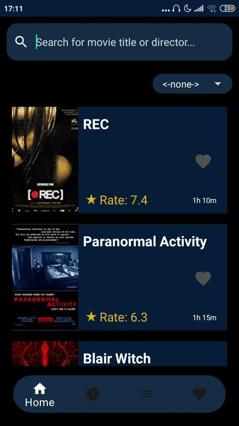

# Found Footage Creep (for Android)
FFC is a database app of information related to found footage movies. Here you'll be able to find all the found footage genre movies and also future realeases. There are more than 1,000 movies, shorts and videos. You can create your own watchlist to never forget that one found footage movie that you're interested on and you can like the movies you love.
## Download Found Footage Creep

  On your android phone you can download the [Found Footage Creep app here](https://play.google.com/store/apps/details?id=com.movies.foundfootage)
  1. Go to **Play Store**.
  2. Search for **Found Footage Creep**.
  3. Find the app and click **Install**.
  
> ## Home

> ## Watchlist

> ## Likes

> ## Releases

> ## Search

 

> ## Screensplash & Movies Details

   
